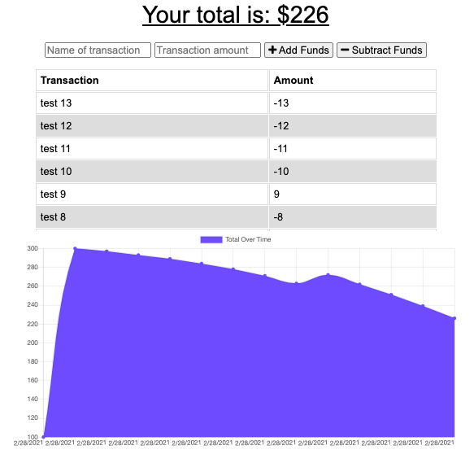

Travel Expense Tracker
==================

## Description 
The travel expense tracker is a  progressive web application that allows the user to record expenses with or without an internet connection. Expenses entered offline will be updated in the cloud when the user has an internet connection.

## Installation
The app can be run from it’s [link here](herokulink) or you can check out the repo [here](https://github.com/hkfernandez/travel-budget). Once you have forked the repo and run `npm i` to install the dependencies you can initiate the app locally by entering `npm run start` and navigating to `localhost:300’ on your PWA enabled browser. 

## Usage 

Use is simple. Enter a short description of your expense and an amount, then select if you would like to add or subtract funds. 

## Credits
I was provided starter code code for the basic functionality of the app. My goal was to make the data persistent when the user was offline using both cache storage and the browser’s indexedDB. Storing and accessing offline data is done with the aid of a service worker. The language is plain vanilla Javascript using [Node](https://nodejs.org/en/) for the backend. The app employs [Express](https://expressjs.com/) for the server and [Mongoose}(https://mongoosejs.com/docs/guide.html) to access the [MongoDB](https://www.mongodb.com/) database. 

## License
MIT

